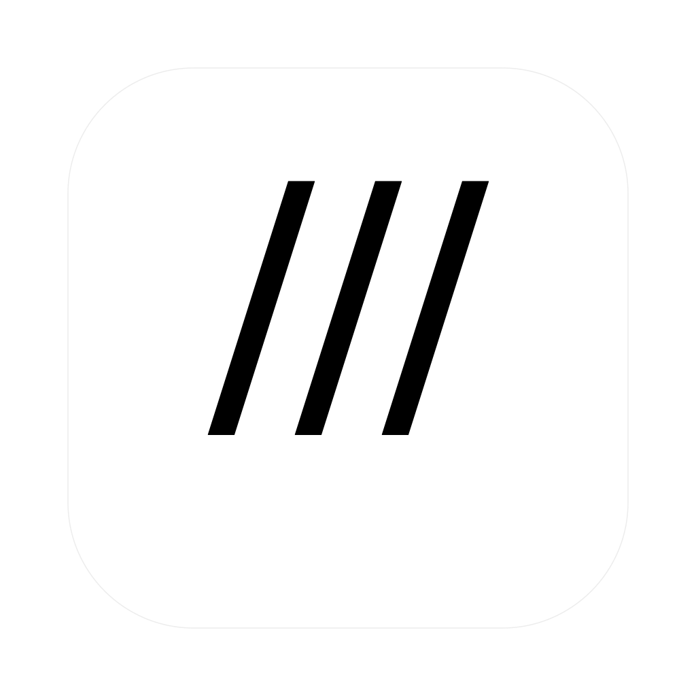

<p align="center">
  
</p>

<h1 align="center">uni</h1>

<p align="center">
  <strong>L'applicazione accademica nativa per macOS.</strong><br>
  <em>Organizza i tuoi corsi, orari 24h da iCal, scadenze, esami e la posta di Outlook. 100% nativa, privata e senza distrazioni.</em>
</p>

<p align="center">
  <a href="https://github.com/zjncoo/uni/releases/latest"></a>
  
  
  
  <a href="LICENSE"></a>
</p>

---

## ✨ Funzionalità Chiave

- 📅 **Sincronizzazione Intelligente Calendario Universitario (iCal / webcal)**:
  Incolla il link webcal del tuo ateneo (Esse3, Cineca, EasyAcademy) o carica un file `.ics`. L'app normalizza automaticamente i titoli delle lezioni, ripulisce sigle di canale, estrae il nome del docente, l'aula assegnata e compila la settimana con orari 24h rigorosamente esatti.

- ✉️ **Integrazione Microsoft Outlook per Mac ("LATEST")**:
  Un bridge AppleScript nativo a basso consumo interroga la posta in arrivo di Outlook su Mac, collegando automaticamente le comunicazioni dei docenti ai rispettivi corsi universitari con opzione di risposta rapida, senza inviare dati al cloud.

- 📂 **File e Intere Cartelle Collegati dal Finder (Zero-Copy)**:
  Trascina documenti singoli (PDF, slide, appunti) o intere cartelle nella scheda di ciascuna materia. I file non vengono copiati né clonati: restano nella loro posizione originale e si aprono con un click o si rivelano istantaneamente nel Finder.

- 🎓 **Gestione Esami, Media Ponderata e Base di Laurea**:
  Registra esami sostenuti e in preparazione, voti, CFU e lodi. Calcola in tempo reale la media aritmetica, la media ponderata e la proiezione esatta del voto base di laurea.

- ⌘ **Ricerca Globale Istantanea (⌘F)**:
  Richiama in qualunque momento una palette di comandi rapida in stile Spotlight per trovare materie, file, appelli o per avviare azioni contestuali.

- ⏳ **Focus Timer Pomodoro**:
  Sessioni di studio concentrato (25 o 50 minuti) e pause con feedback acustico discreto e non invasivo.

- 🔔 **Notifiche In-App a Pillola (Solid HUD)**:
  Banner di notifica fluttuanti a forma di capsula con sfondo opaco al 100% e promemoria tempestivi per scadenze e consegne.

- 🌐 **Localizzazione Completa (Italiano & English)**:
  L'intera interfaccia è tradotta sia in italiano che in inglese, con cambio istantaneo dalle Impostazioni.

- 🎨 **Temi & Contrasti Automatici**:
  Supporto fluido per Modalità Chiara e Modalità Scura, con colori d'accento personalizzabili e contrasto elevato sempre conforme agli standard WCAG.

---

## 💻 Requisiti di Sistema

- **Piattaforma**: Mac con Apple Silicon (M1/M2/M3/M4) oppure processore Intel a 64-bit
- **Sistema Operativo**: macOS 14.0 (Sonoma) o versioni successive
- **Framework**: SwiftUI, AppKit, Combine, Foundation

---

## 🛠 Compilazione da Codice Sorgente

Se desideri compilare l'applicazione direttamente dal codice:

```bash
# 1. Clona la repository
git clone https://github.com/zjncoo/uni.git
cd uni

# 2. Apri il progetto in Xcode
open uni.xcodeproj
```

In Xcode:
1. Seleziona lo schema **uni** e il dispositivo di destinazione **My Mac**.
2. Premi **⌘R** (Run) per compilare ed eseguire l'app.
3. Per creare una build di distribuzione, seleziona **Product > Archive**.

---

## 🌐 Sito Vetrina Ufficiale

La cartella [`docs/`](docs/) contiene la landing page ufficiale del progetto, configurata per essere servita direttamente tramite **GitHub Pages**:
- Design in modalità chiara con estetica raffinata in stile Apple.
- Rilevamento automatico della lingua del browser (`IT` / `EN`) con selettore dedicato.
- Mockup interattivo dell'interfaccia macOS e simulazione delle notifiche.

---

## 📄 Licenza & Crediti
 
Rilasciato sotto licenza [MIT](LICENSE). Copyright © 2026 [zinco.cc](https://zinco.cc).  
Designed & developed by [zinco.cc](https://zinco.cc).
